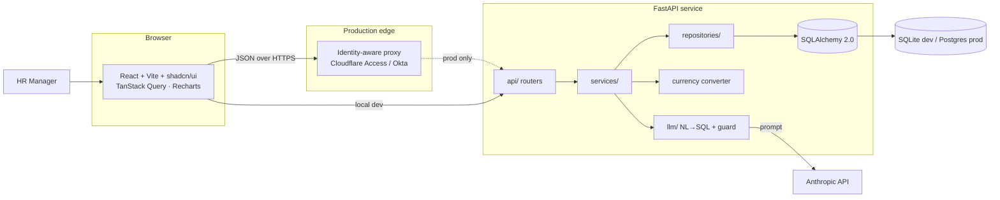
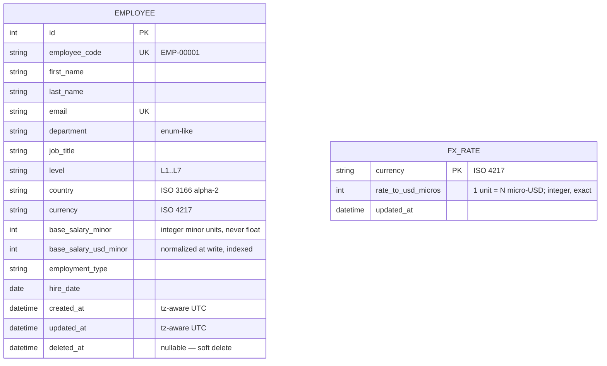
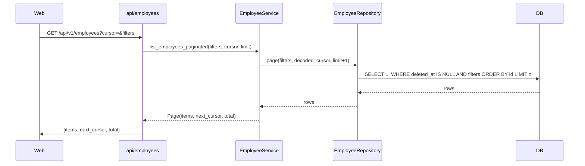
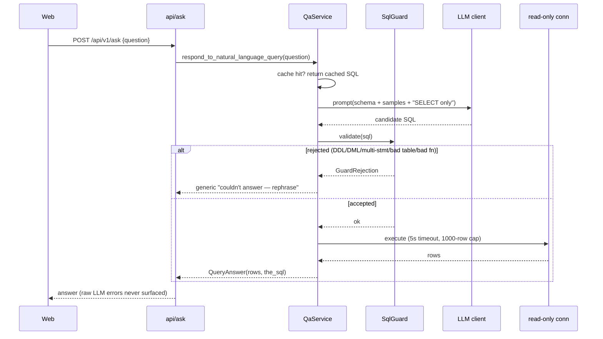

# Architecture — ACME Salary Management

This document is a contract. Code that contradicts it is a bug in one of the two — fix the
doc first if the doc is wrong (per `CLAUDE.md`).

## 1. System context



Auth is intentionally the proxy's job, not the app's (`ADR-0009`). Locally the browser talks
to the API directly.

## 2. Layered architecture & dependency rule

```
api/  →  services/  →  repositories/  →  models/
                 ↘  domain/   (value objects, importable anywhere)
                 ↘  core/     (config, db, logging, errors — importable anywhere)
```

Dependencies point **one way only**: an inner layer never imports an outer one. Concretely:

- **`api/`** — HTTP only. Parses requests into Pydantic, calls a service, maps the result to a
  response schema, sets status codes. No business rules, no ORM, no `session.commit()`.
- **`services/`** — business logic and orchestration. Owns transactions. Depends on repository
  **Protocols** injected via `Depends`, never on concrete repository classes (DIP). Maps ORM ⇄
  Pydantic explicitly — no `from_orm` magic, so a reader can trace data flow.
- **`repositories/`** — the only layer that speaks SQLAlchemy. Builds queries, applies filters /
  cursor pagination / eager loading. Returns ORM objects and primitives; never imports Pydantic.
- **`models/`** — persistence shape (`Mapped[...]` declarative).
- **`domain/`** — pure, immutable value objects (`Money`, `EmployeeId`, `Country`,
  `Compensation`). No framework imports. This is where money arithmetic and currency rules live.
- **`core/`** — config, engine/session factory, structured logging, error envelope, middleware.
- **`llm/`** — prompt building, the SQL guard (a parser, not a regex), and the Anthropic client
  wrapper. Isolated so the highest-risk surface has one home.

Why this shape: it makes the business logic unit-testable with a fake repository (no DB), keeps
the SQL injection-free in one layer, and lets a new engineer find any concern by its folder name.

## 3. Data model



Key decisions (each has an ADR): **money is integer minor units + an ISO-4217 code, never
float** (`ADR-0006`); **soft delete** via `deleted_at`, filtered by default; **history is
deferred but additively designed** (`ADR-0003`). Indexes exist on the query shapes that actually
run: `(department)`, `(country)`, `(level)`, `(base_salary_usd_minor)`, plus a composite
`(country, department, level)` for the analytics group-bys, and `(deleted_at)` for the default
filter.

## 4. Request flows

### List employees (cursor pagination)



### Natural-language Q&A (the guarded path)



## 5. Cross-cutting

- **Errors:** one envelope `{ "error": { "code", "message", "details" } }`; stable string codes,
  HTTP status carries the class. Raised as typed exceptions in services, mapped to envelopes by a
  single exception handler in `core/`.
- **Observability:** request-ID middleware stamps every log line and the `X-Request-ID` header;
  structured JSON logs in prod, console locally; **salary amounts are never logged**.
- **Health:** `/healthz` (process alive) and `/readyz` (DB reachable + migrations current) for
  the platform's routing checks.
- **Config:** a single `Settings` (pydantic-settings) reads env; the `DATABASE_URL` driver picks
  SQLite vs Postgres — one engine factory, never two.

## 6. Frontend

Server state lives in **TanStack Query** (`ADR-0008`); UI state in `useState`. One typed API
client + one query hook per resource (`useEmployees`, `useEmployee`, `useAnalyticsSummary`,
`useAsk`). Components never touch `queryClient` directly. Lists are server-paginated; charts
receive **pre-aggregated buckets**, never raw rows. shadcn/ui over a heavier kit (`ADR-0010`).

## 7. Trade-offs at a glance

| Decision | Bought | Paid | ADR |
|---|---|---|---|
| FastAPI | async, Pydantic validation, free OpenAPI | less batteries than Django | 0001 |
| SQLite dev / Postgres prod | zero-setup review, prod parity via one URL | SQLite single-writer | 0002 |
| Integer minor units | exact money, no float drift | manual major⇄minor at edges | 0006 |
| Cursor pagination | stable pages over 10k, no deep-offset scans | no random page jumps | 0007 |
| LLM → guarded SQL | NL questions without engineers | guard + read-only path complexity | 0004 |
| Auth deferred to proxy | no half-built security | not runnable public without the proxy | 0009 |
